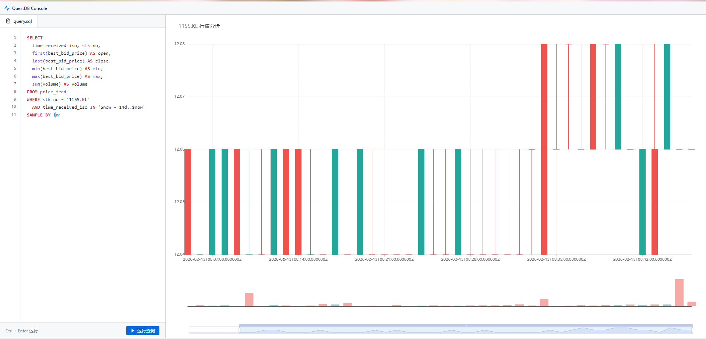

# QuestDB OHLCV 测试项目

一个基于 Vue 3、TypeScript 和 QuestDB 构建的高性能股票图表应用程序。通过 ECharts 实现实时 OHLCV（开盘价、最高价、最低价、收盘价、成交量）数据可视化，并支持 SQL 查询与语法高亮。

## 主要特性

- **自定义 SQL 查询**：支持直接输入 QuestDB SQL 语句进行灵活的数据检索和聚合。内置**实时语法高亮**（关键字、函数、QuestDB 特有时间单位），提供专业的代码编辑体验。
- **GitHub Light 主题**：全站采用 GitHub Light 风格配色，提供清爽、现代的代码阅读与图表浏览界面。
- **专业 K 线图表**：基于 ECharts 深度定制的 OHLCV 图表，支持智能缩放、自适应 K 线宽度、红涨绿跌配色及成交量分析。
- **QuestDB 集成**：通过 QuestDB REST API 进行高性能时序数据抓取，支持 `SAMPLE BY` 等高级聚合查询。
- **响应式布局**：侧边栏编辑器与右侧图表自适应布局，优化宽屏显示。
- **Vite 代理**：预配置反向代理，解决开发环境下的 CORS 跨域问题。

## Demo


## 技术栈

- **前端框架**：Vue 3 (Composition API)
- **开发语言**：TypeScript
- **样式处理**：CSS Variables + GitHub Light Theme
- **图表库**：ECharts & vue-echarts
- **数据库**：QuestDB
- **构建工具**：Vite
- **路由管理**：Vue Router

## 安装指南

1. **克隆仓库**：
   ```bash
   git clone <repository-url>
   cd QuestDBOHLCVTest
   ```

2. **安装依赖**：
   ```bash
   bun install
   # 或者
   npm install
   ```

3. **配置环境变量**：
   复制示例环境文件并填写您的 QuestDB 配置：
   ```bash
   cp .env.example .env
   ```
   `.env` 中的关键变量：
   - `VITE_QDB_HTTP_URL`: QuestDB REST API 端点（默认：`http://127.0.0.1:9000`）
   - `VITE_QDB_TABLE`: QuestDB 中的表名（例如：`price_feed`）

## 使用说明

1. **启动开发服务器**：
   ```bash
   bun dev
   # 或者
   npm run dev
   ```

2. **访问应用**：
   打开浏览器并访问 `http://localhost:5173`。

## 项目结构

- `src/components/`: UI 组件（如 [OHLCVCharView.vue](file:///c:/Users/ChengTzeKeong/Desktop/VFPrice/QuestDBOHLCVTest/src/components/OHLCVCharView.vue)）
- `src/styles/`: 样式文件（如 [chartStyle.css](file:///c:/Users/ChengTzeKeong/Desktop/VFPrice/QuestDBOHLCVTest/src/styles/chartStyle.css)）
- `src/composables/`: 可复用逻辑（如用于数据抓取的 [useOHLCVChart.ts](file:///c:/Users/ChengTzeKeong/Desktop/VFPrice/QuestDBOHLCVTest/src/composables/useOHLCVChart.ts)）
- `src/types/`: TypeScript 类型定义（如 [Timeframe.ts](file:///c:/Users/ChengTzeKeong/Desktop/VFPrice/QuestDBOHLCVTest/src/types/Timeframe.ts)）
- `src/router/`: 路由配置
- `vite.config.ts`: 包含 CORS 代理设置的 Vite 配置

## CORS 配置

项目包含 Vite 代理配置以处理 QuestDB 的 CORS 问题。所有发往 `/qdb` 的请求将自动转发到 `.env` 文件中定义的 `VITE_QDB_HTTP_URL`。

## 许可证

仅供内部使用
